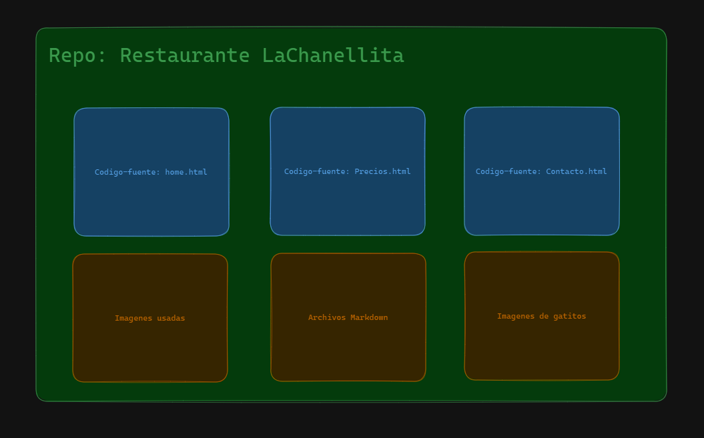
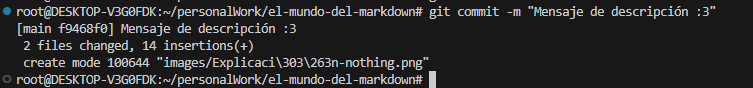
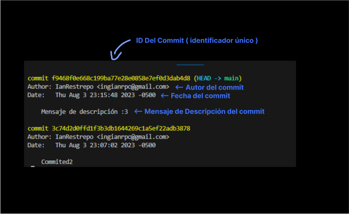
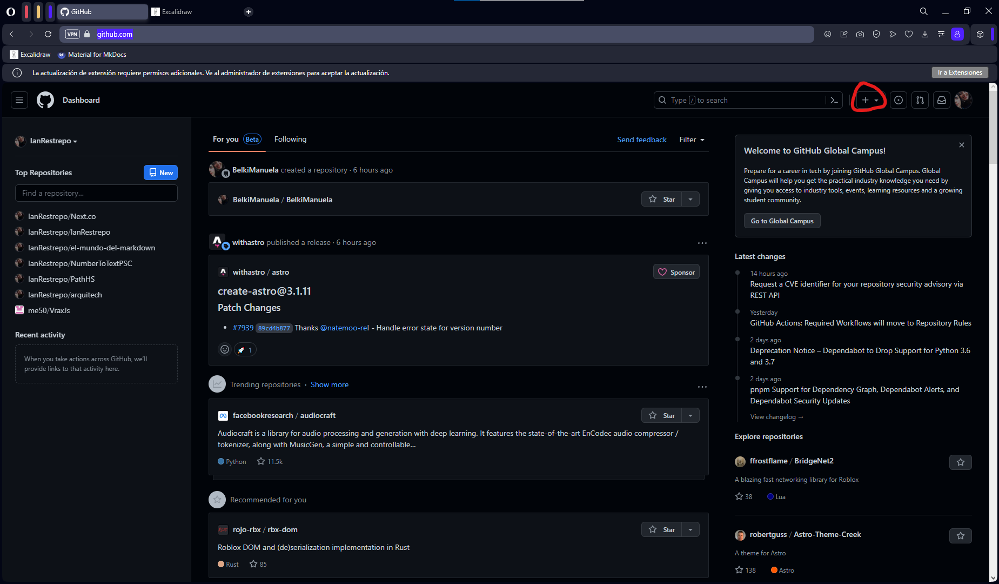
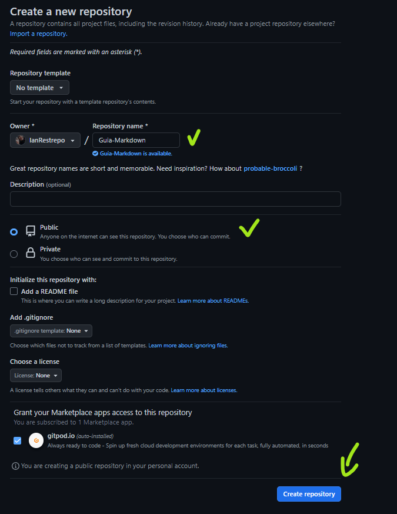
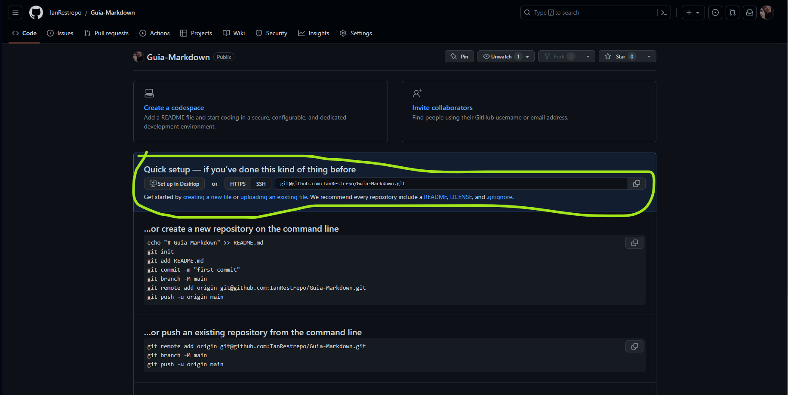

# Guia GIT

Git es un controlador de versiones que a mi parecer puede ser un poco confuso si no entiendes perfectamente el concepto o si eres nuevo del todo dentro del mundo del desarrollo, pero para eso haré esta guia, para mi en caso de que en un futuro olvide algo o no lo entienda y para estudiar obviamente, pero tambien para mi novia **@BelkiManuela**, Bien, ahora si ¡Comenzemos!

## Entendiendo los repositorios

Dentro de el tema de las versiones y git y eso, existe algo llamado repositorios, para entender bien que son y para que sirven los repositorios podriamos imaginarnos una caja en donde estamos guardando todo el codigo de nuestra aplicación, asi podemos realizar y administrar cambios dentro del codigo de nuestra aplicación y guardarla dentro de nuestro repositorio

*Ejemplo grafico*:



Ahora bien, conociendo el concepto basico de que es y para que sirvenlos Repositorios o Repo's vamos a crear uno con git!

## Creación de Repo local

***ACLARACIÓN*** Cuando hablo de " Repo **Local** " me refiero a que haremos un repositorio dentro de nuestro computador es decir *LOCALMENTE* en nuestra maquina, ahora bien, para crear un repositorio local debemos de tener un proyecto primero, y luego dentro de nuestra terminal de comandos deberemos de ejecutar el siguiente comando

```bash
 git init 
```
> Este comando lo que hara es que nos permitira iniciar/crear un repositorio local y ahora si podremos hacer uso de el...

## Añadir cosas al Repo

Para añadir nuestro codigo/archivos o lo que sea que queramos añadir a nuestro repositorio, necesitaremos utilizar el siguiente comando:
```bash
git add < archivo-que-desea-añadir >
```
Esto lo que hara será añadir lo que deseemos a nuestro repositorio, **OJO** si deseamos añadir todo el proyecto solo es cuestion de poner un punto despues de add algo asi:          "`git add .`" esto  para asi añadir todo lo que este dentro de nuestra carpeta.

## Git Stage

Recordemos que el Git stage es en donde estan los archivos que ya estan listos ( los que le hicimos git add ) el stage SOLO contiene los que estan listos más no los que ya tuvieron su Commit, cosa que aprenderemos a hacer en el siguiente cap, ahora bien, Como podemos ver nuestro Stage? ¡Buena Pregunta! de una manera muy sencilla, solamente necesitaremos utilizar el comando de `git status` para poder ver el estado de nuestrosa archivos que  Han sido modificados o que ya están listos persé y se ve algo asi

**Contexto**: Nuevo archivo en el stage


**Contexto**: Archivo modificado


**Contexto**: No hay archivos en el stage


## Commit-land

¡Ahora si! llegamos a los famosisimos commits, has de recordar que todo tiene un proceso y hasta ahora nuestros archivos no estan dentro del repositorio si no que se encuentran en el **stage**, pero para añadirlos al repositorio es cuestion de hacer un:

```bash
git commit -m "Mensaje de descripción :3" 
```
el -m es para poner un  **Mensaje** por es -m, por **-MESSAGE**, bien haciendo eso tendremos este mensaje de respuesta en nuestra terminal:



Y listo!❤ nuestros archivos estan ahora dentro de nuestro repositorio.

## Los Logs 👀

Git esta pensado para que lo manejes con otros desarrolladores, y si por alguna razón llega a ocurrir algun error tienes la posibilidad de ver el Log o el registro de que se hizo y quien lo hizo, usando el comando `git log`, que nos deberia de retornar algo asi:



## Conexión con Github

Hasta ahora hemos manejado Git a la perfección pero, si deseamos ver lo que hemos hecho de manera visual necesitaremos **Github**, ahora bien, nosotros tenemos un repositorio **LOCAL** Es decir que solo lo tenemos Nosotros, y para poder guardarlo en la nube osea de manera remota deberemos de crear un repositorio dentro de github **ACLARO** El repositorio de github y el repositorio local **NO** Son el mismo, pero los conectaras para que sean uno mismo! ( fusionarlos para que se entienda mejor ).

Bueno pero entonces... ¿Como creo mi repositorio en github?, bueno pues sigue mis pasos:

1. Ingresa a [Github](https://github.com) y dale click en el signo de más o añadir:

    

2. Dale en New Repository y rellena los campos necesarios tales como nombre y demás.

    

### ¡Ya creaste un Repo en Github! ahora es momento de conectarlos

Para conectarlos deberas de usar este pequeño codigo que te da github para enlazarlo a tu repo: 



Ahora nuevamente en tu terminal deberas de escribi el siguiente codigo para la conexión

```bash
git remote add origin < codigo-que-tienes-en-github >

Ejemplo:

git remote add origin git@github.com:IanRestrepo/Guia-Markdown.git
```
